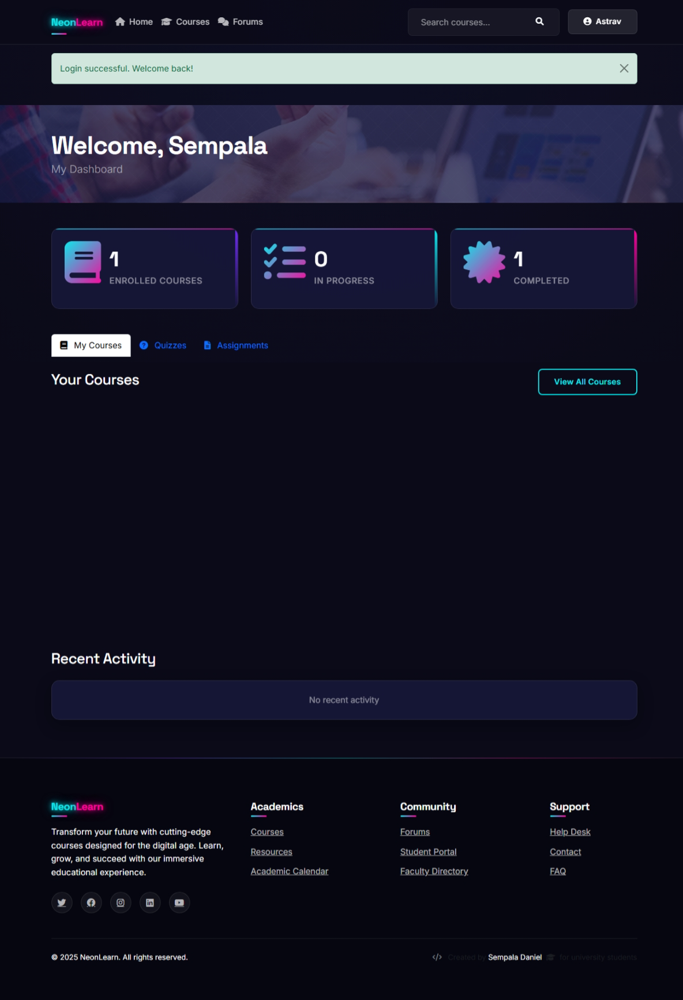
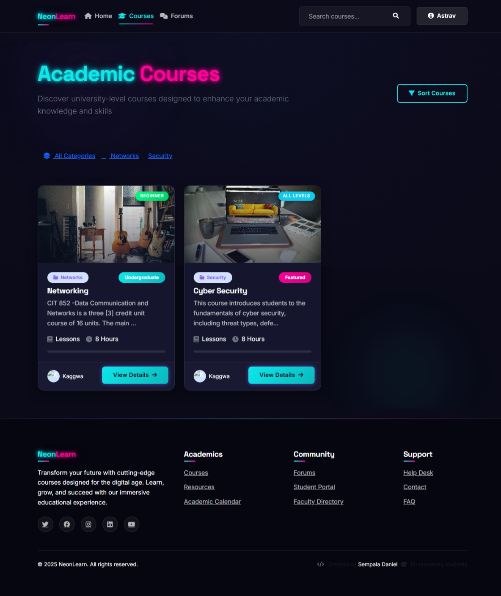

# 🎓 E-Learning Platform

<div align="center">


[](https://www.djangoproject.com/)
[](https://www.python.org/)
[](LICENSE)
[](https://github.com/yourusername/e-learning)

*A modern, feature-rich e-learning platform built with Django for educational institutions and online course providers*

</div>

---

## 📚 Overview

The **E-Learning Platform** is a comprehensive solution designed to facilitate online education. It provides a seamless interface for both instructors and students, with features like course management, quiz assessments, discussion forums, and detailed progress tracking.

<div align="center">
<table>
  <tr>
    <td align="center"><b>🎯 For Students</b></td>
    <td align="center"><b>👨‍🏫 For Instructors</b></td>
    <td align="center"><b>👑 For Administrators</b></td>
  </tr>
  <tr>
    <td>
      ✅ Enroll in courses<br>
      ✅ Access learning materials<br>
      ✅ Take quizzes and assessments<br>
      ✅ Track personal progress<br>
      ✅ Participate in forums
    </td>
    <td>
      ✅ Create and manage courses<br>
      ✅ Upload learning materials<br>
      ✅ Design quizzes and tests<br>
      ✅ Monitor student performance<br>
      ✅ Engage with students
    </td>
    <td>
      ✅ User role management<br>
      ✅ Content moderation<br>
      ✅ System configuration<br>
      ✅ Analytics and reporting<br>
      ✅ Platform maintenance
    </td>
  </tr>
</table>
</div>

---

## 📷 Screenshots

<div align="center">
  <h3>Student Dashboard</h3>
  
  <p><em>The student dashboard provides an overview of enrolled courses and progress</em></p>
  
  <h3>Course View</h3>
  
  <p><em>Detailed course view with lessons, materials and progress tracking</em></p>
  
  <h3>Instructor Interface</h3>
  
  <p><em>Powerful tools for instructors to manage courses and monitor student progress</em></p>
  
  <h3>Quiz System</h3>
  
  <p><em>Interactive quiz system with various question types and instant feedback</em></p>
</div>

## ✨ Key Features

### 👥 User Management
- **Dual Role System**: Students and Instructors with tailored interfaces
- **Profile Management**: Customizable profiles with avatars and bio information
- **Authentication**: Secure login with session management and "Remember me" functionality

### 📝 Course Management
- **Course Creation**: Intuitive interface for instructors to build courses
- **Content Organization**: Structured content with sections and lessons
- **Media Support**: Video, document, and presentation uploads
- **Enrollment Tracking**: Course enrollment and completion monitoring

### 📊 Assessment System
- **Quiz Creation**: Various question types (multiple choice, true/false, essay)
- **Automated Grading**: Instant feedback for objective questions
- **Progress Tracking**: Detailed analytics on student performance
- **Custom Assessments**: Assignments with manual grading options

### 💬 Communication
- **Discussion Forums**: Course-specific forums for student-instructor interaction
- **Announcements**: Course-wide notifications and updates
- **Comments**: In-context discussions on specific content

### 📱 User Experience
- **Responsive Design**: Optimized for both desktop and mobile devices
- **Intuitive Navigation**: User-friendly interface for all user types
- **Accessibility**: Designed with accessibility standards in mind

---

## 🚀 Getting Started

### Prerequisites
- Python 3.8+
- pip (Python package manager)
- Virtual environment tool (venv, virtualenv, or conda)

### Installation

1. **Clone the repository**
   ```bash
   git clone https://github.com/AstronDaniel/e_learning.git
   cd e-learning
   ```

2. **Create and activate a virtual environment**
   ```bash
   # Using venv (Python 3.3+)
   python -m venv venv
   
   # On Windows
   venv\Scripts\activate
   
   # On macOS/Linux
   source venv/bin/activate
   ```

3. **Install dependencies**
   ```bash
   pip install -r requirements.txt
   ```

4. **Apply migrations**
   ```bash
   python manage.py migrate
   ```

5. **Create a superuser**
   ```bash
   python manage.py createsuperuser
   ```

6. **Run the development server**
   ```bash
   python manage.py runserver
   ```

7. **Access the site**
   - Open your browser and navigate to: http://127.0.0.1:8000/
   - Admin interface: http://127.0.0.1:8000/admin/ (use superuser credentials)

---

## 📂 Project Structure

```
e_learning/              # Project root
├── courses/             # Course management app
├── users/               # User management app
├── quizzes/             # Quiz functionality
├── forums/              # Discussion forums
├── instructor/          # Instructor-specific features
├── docs/                # Project documentation
├── static/              # Static assets
├── media/               # User-uploaded content
├── templates/           # HTML templates
└── e_learning/          # Project configuration
```

## 📖 Documentation

Comprehensive documentation is available in the `docs/` directory:

- **[User Guides](docs/usage/)**: Instructions for students, instructors, and administrators
- **[Development Documentation](docs/development/)**: Setup, architecture, and contribution guidelines
- **[API Documentation](docs/api/)**: API reference for integrations
- **[Deployment Guide](docs/deployment.md)**: Instructions for deploying to production

## 🖼️ Adding Your Own Screenshots

The placeholder screenshots in this README should be replaced with actual screenshots of your application. To add your own:

1. Take screenshots of key parts of your application
2. Save them in the `docs/screenshots/` directory
3. Make sure they match the filenames referenced in this README, or update the image paths
4. See [Screenshot Guidelines](docs/screenshots/README.md) for more details

---

## 🤝 Contributing

Contributions are what make the open-source community such an amazing place to learn, inspire, and create. Any contributions you make are **greatly appreciated**.

1. Fork the Project
2. Create your Feature Branch (`git checkout -b feature/AmazingFeature`)
3. Commit your Changes (`git commit -m 'Add some AmazingFeature'`)
4. Push to the Branch (`git push origin feature/AmazingFeature`)
5. Open a Pull Request

Please make sure your code follows our coding standards and includes appropriate tests.

---

## 📄 License

Distributed under the MIT License. See `LICENSE` for more information.

---

## 📬 Contact

Project Link: https://github.com/AstronDaniel/e_learning.git)]

---

<div align="center">
  <sub>Built with ❤️ by Your Name</sub>
</div>
